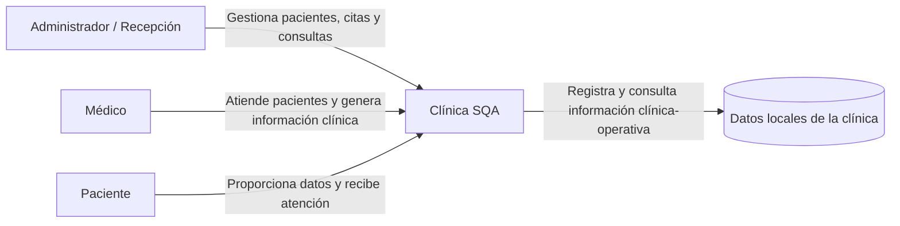
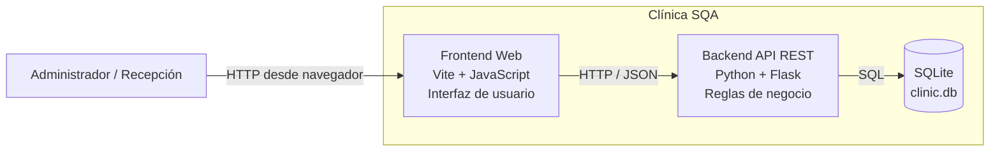
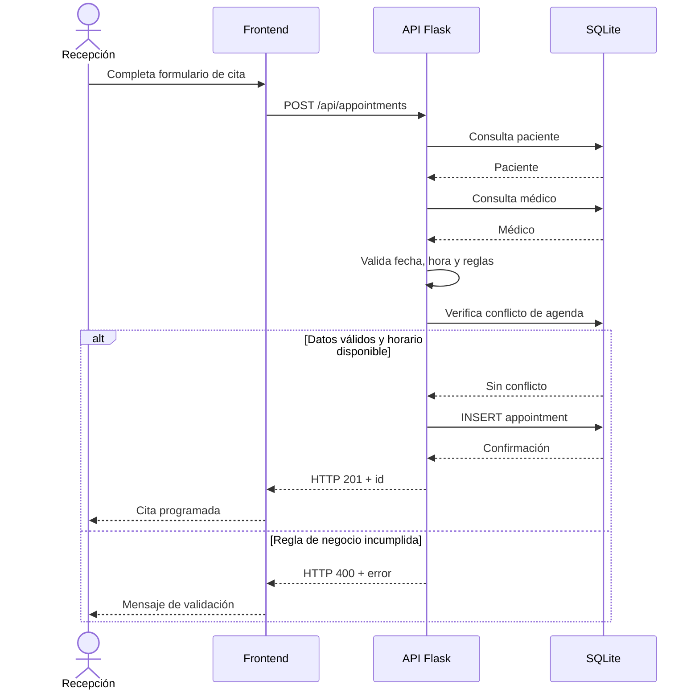
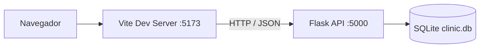
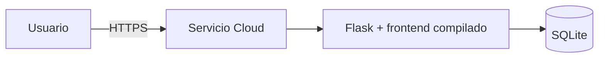

# E2 — Documentación de arquitectura a alto nivel

## 1. Objetivo

Este documento describe la arquitectura de alto nivel de **Clínica SQA**, aplicación web utilizada como objeto de evaluación en el proyecto de Aseguramiento de la Calidad de Software.

La arquitectura fue definida con un alcance deliberadamente simple: una solución cliente-servidor en un solo repositorio, con frontend y backend claramente separados, persistencia SQLite local y sin microservicios ni integraciones externas obligatorias.

---

# 2. Estilo arquitectónico

La aplicación utiliza una arquitectura **cliente-servidor** organizada como **monorepo**.

Los componentes principales son:

- **Frontend:** aplicación web construida con Vite y JavaScript.
- **Backend:** API REST construida con Python y Flask.
- **Persistencia:** base de datos SQLite.
- **Repositorio:** GitHub.
- **Despliegue previsto:** un único servicio web capaz de servir el backend y, en despliegue, los archivos estáticos generados por el frontend.

Durante el desarrollo, frontend y backend se ejecutan como procesos separados. Para despliegue, el frontend puede compilarse y ser servido por Flask como parte de un único artefacto desplegable.

Esta decisión reduce la complejidad operativa sin eliminar la separación requerida entre cliente y servidor.

---

# 3. Diagrama de contexto

El diagrama de contexto representa a Clínica SQA como un único sistema y muestra a los actores que interactúan o se ven afectados por él.



## 3.1 Actores

### Administrador / Recepción

Es el usuario directo de la aplicación en la versión actual. Utiliza el sistema para:

- iniciar sesión;
- registrar y buscar pacientes;
- consultar médicos;
- programar y reprogramar citas;
- gestionar estados de citas;
- registrar consultas;
- consultar agenda e indicadores.

### Médico

Actor del dominio asociado a las citas y consultas. En la versión actual no posee una interfaz independiente; su información se registra y administra desde la operación clínica.

### Paciente

Actor del dominio sobre el cual se registran datos personales, citas y atención clínica. No posee acceso directo al sistema en el alcance actual.

## 3.2 Sistemas externos

La versión evaluada **no depende de sistemas externos obligatorios**. No existen integraciones con:

- aseguradoras;
- servicios de pago;
- correo electrónico;
- SMS;
- WhatsApp;
- laboratorios;
- expedientes externos.

Esto mantiene el proyecto autocontenido y facilita las pruebas funcionales y automatizadas.

---

# 4. Diagrama de contenedores

El siguiente diagrama presenta los contenedores principales de la solución.



## 4.1 Frontend

Responsabilidades:

- mostrar formularios y tablas;
- capturar datos del usuario;
- consumir la API REST;
- mostrar respuestas y mensajes de error;
- presentar agenda e indicadores;
- mantener una sesión de interfaz básica mediante `sessionStorage`.

Ubicación principal:

```text
frontend/
├── index.html
├── package.json
└── src/
    ├── api.js
    ├── main.js
    └── styles.css
```

## 4.2 Backend

Responsabilidades:

- exponer endpoints REST;
- validar entradas;
- aplicar reglas de negocio;
- controlar estados de citas;
- gestionar persistencia;
- inicializar la base de datos;
- devolver respuestas JSON al frontend.

Ubicación principal:

```text
backend/
├── run.py
├── requirements.txt
└── app/
    ├── __init__.py
    ├── db.py
    ├── schema.sql
    ├── routes/
    │   └── api.py
    └── services/
        ├── appointments.py
        └── validation.py
```

## 4.3 Base de datos

SQLite se utiliza como almacenamiento local.

El archivo se genera en:

```text
backend/data/clinic.db
```

La base de datos no se versiona en Git.

El esquema se inicializa automáticamente al iniciar la aplicación.

---

# 5. Tecnologías utilizadas

| Componente | Tecnología | Propósito |
|---|---|---|
| Frontend | HTML5 | Estructura de la interfaz |
| Frontend | CSS3 | Presentación visual |
| Frontend | JavaScript ES Modules | Lógica de interfaz y consumo de API |
| Frontend | Vite | Servidor de desarrollo y compilación |
| Backend | Python | Lenguaje principal del servidor |
| Backend | Flask | Framework web y API REST |
| Backend | Flask-CORS | Comunicación entre frontend y backend durante desarrollo |
| Backend | Gunicorn | Servidor WSGI previsto para despliegue |
| Datos | SQLite | Persistencia relacional local |
| Control de versiones | Git | Historial y control de cambios |
| Repositorio | GitHub | Alojamiento del código fuente |
| Documentación | Markdown + Mermaid | Documentación y diagramas versionados |

---

# 6. Dependencias externas

## 6.1 Dependencias de ejecución del backend

```text
Flask
Flask-Cors
gunicorn
```

## 6.2 Dependencias de desarrollo del frontend

```text
Vite
```

## 6.3 Dependencias de infraestructura

La aplicación no necesita un servidor de base de datos separado porque SQLite trabaja sobre un archivo local.

En desarrollo se requiere:

- Python 3.11 o superior;
- Node.js 20 o superior;
- navegador web moderno;
- Git.

No existen APIs de terceros necesarias para que las funciones principales operen.

---

# 7. Modelo de datos principal

Las entidades principales son:

- `users`
- `doctors`
- `patients`
- `appointments`
- `consultations`

## 7.1 Diagrama entidad-relación

```mermaid
erDiagram
    USERS {
        INTEGER id PK
        TEXT username UK
        TEXT password
        TEXT role
    }

    DOCTORS {
        INTEGER id PK
        TEXT name UK
        TEXT specialty
    }

    PATIENTS {
        INTEGER id PK
        TEXT first_name
        TEXT last_name
        TEXT birth_date
        TEXT phone
        TEXT email
        INTEGER active
        TEXT created_at
    }

    APPOINTMENTS {
        INTEGER id PK
        INTEGER patient_id FK
        INTEGER doctor_id FK
        TEXT appointment_date
        TEXT appointment_time
        TEXT reason
        TEXT status
        TEXT created_at
    }

    CONSULTATIONS {
        INTEGER id PK
        INTEGER appointment_id FK_UK
        TEXT diagnosis
        TEXT treatment
        TEXT notes
        TEXT created_at
    }

    PATIENTS ||--o{ APPOINTMENTS : "posee"
    DOCTORS ||--o{ APPOINTMENTS : "atiende"
    APPOINTMENTS ||--o| CONSULTATIONS : "genera"
```

---

# 8. Descripción de entidades

## 8.1 users

Almacena los usuarios utilizados para autenticación.

Campos relevantes:

- identificador;
- nombre de usuario;
- contraseña;
- rol.

En la versión académica se utiliza un usuario administrativo inicial.

## 8.2 doctors

Contiene el catálogo de médicos.

Campos relevantes:

- identificador;
- nombre;
- especialidad.

Los médicos se cargan inicialmente como datos semilla.

## 8.3 patients

Contiene la información de pacientes.

Campos relevantes:

- nombres;
- apellidos;
- fecha de nacimiento;
- teléfono;
- correo;
- estado activo/inactivo.

La condición `active = 1` es necesaria para que el paciente pueda recibir una nueva cita.

## 8.4 appointments

Es la entidad central de la lógica de negocio.

Relaciona:

- paciente;
- médico;
- fecha;
- hora;
- motivo;
- estado.

Estados definidos:

```text
PROGRAMADA
CONFIRMADA
ATENDIDA
CANCELADA
NO_ASISTIO
```

## 8.5 consultations

Registra la atención clínica derivada de una cita confirmada.

Campos principales:

- cita;
- diagnóstico;
- tratamiento;
- notas.

Una cita puede tener como máximo una consulta.

---

# 9. Flujo principal de información



---

# 10. Módulos principales

| Módulo | Ubicación | Responsabilidad |
|---|---|---|
| Inicialización | `backend/app/__init__.py` | Configura Flask, CORS, rutas, DB y frontend compilado |
| Persistencia | `backend/app/db.py` | Conexión SQLite, creación de esquema y datos semilla |
| Esquema | `backend/app/schema.sql` | Definición de tablas, relaciones e índices |
| API | `backend/app/routes/api.py` | Endpoints HTTP y coordinación de operaciones |
| Agenda | `backend/app/services/appointments.py` | Programación, reprogramación, conflictos y estados |
| Validaciones | `backend/app/services/validation.py` | Reglas de datos, fechas, horarios y formatos |
| Cliente API | `frontend/src/api.js` | Encapsula solicitudes HTTP |
| Interfaz | `frontend/src/main.js` | Flujo de interfaz y eventos |
| Estilos | `frontend/src/styles.css` | Presentación visual |

---

# 11. Identificación de módulos críticos

Un módulo se considera crítico cuando un defecto puede impedir la atención clínica, provocar inconsistencia de información o afectar directamente reglas esenciales del negocio.

## 11.1 MC-01 — Programación y validación de citas

**Archivos principales:**

- `backend/app/services/appointments.py`
- `backend/app/services/validation.py`

**Criticidad:** Muy alta.

**Justificación:**

La agenda es el núcleo funcional de la aplicación. Un error podría:

- crear citas en horarios inválidos;
- asignar dos pacientes al mismo médico en el mismo horario;
- permitir citas a pacientes inactivos;
- registrar datos inconsistentes.

**Funciones prioritarias para pruebas unitarias en fase 2:**

- `create_appointment`
- `assert_slot_available`
- `validate_appointment_datetime`
- `assert_patient_active`
- `assert_doctor_exists`

---

## 11.2 MC-02 — Transición de estados de citas

**Archivo principal:**

`backend/app/services/appointments.py`

**Criticidad:** Muy alta.

**Justificación:**

El estado representa la situación real de la cita. Una transición inválida puede generar información clínica contradictoria.

Reglas críticas:

```text
PROGRAMADA -> CONFIRMADA
PROGRAMADA -> CANCELADA

CONFIRMADA -> ATENDIDA
CONFIRMADA -> CANCELADA
CONFIRMADA -> NO_ASISTIO
```

Los estados finales no deben permitir nuevas transiciones.

**Función prioritaria:**

`transition_status`

---

## 11.3 MC-03 — Registro de consulta médica

**Ubicación principal:**

`backend/app/routes/api.py`

**Criticidad:** Muy alta.

**Justificación:**

El registro debe preservar consistencia entre:

- consulta creada;
- cita asociada;
- estado final `ATENDIDA`.

Si una parte falla, no debe quedar una consulta incompleta ni una cita incorrectamente marcada como atendida.

La operación debe comportarse como una unidad lógica.

---

## 11.4 MC-04 — Validación de datos de pacientes

**Archivo principal:**

`backend/app/services/validation.py`

**Criticidad:** Alta.

**Justificación:**

Los datos del paciente se reutilizan en todo el proceso. Errores de validación pueden introducir fechas imposibles, teléfonos inválidos o datos incompletos que después afecten operaciones posteriores.

Funciones prioritarias:

- `require_text`
- `validate_birth_date`
- `validate_phone`
- `validate_email`

---

## 11.5 MC-05 — Persistencia e inicialización

**Archivos principales:**

- `backend/app/db.py`
- `backend/app/schema.sql`

**Criticidad:** Alta.

**Justificación:**

Un fallo en este componente impide que el sistema opere o puede comprometer la integridad referencial entre pacientes, médicos, citas y consultas.

Aspectos a verificar:

- creación automática de la base;
- claves foráneas;
- restricciones de estados;
- unicidad de consulta por cita;
- datos semilla.

---

## 11.6 MC-06 — Autenticación

**Ubicación principal:**

`backend/app/routes/api.py`

**Criticidad:** Media-Alta.

**Justificación:**

La autenticación controla el acceso inicial. Sin embargo, la implementación actual es intencionalmente básica y forma parte del alcance académico, no de un sistema clínico productivo.

Debe verificarse como mínimo:

- aceptación de credenciales válidas;
- rechazo de credenciales inválidas;
- ausencia de contraseña en la respuesta.

---

# 12. Priorización para cobertura unitaria de Fase 2

Los módulos definidos como alcance prioritario de cobertura serán:

| Prioridad | Módulo | Objetivo |
|---|---|---|
| 1 | Agenda y conflictos | Evitar doble reserva y horarios inválidos |
| 2 | Estados de citas | Evitar transiciones ilegales |
| 3 | Validaciones | Evitar entradas fuera de reglas |
| 4 | Consulta médica | Preservar consistencia de atención |
| 5 | Persistencia | Verificar esquema e inicialización |
| 6 | Autenticación | Validar acceso básico |

La mayor concentración de pruebas unitarias deberá ubicarse sobre los servicios de negocio del backend, porque son los componentes con mayor impacto funcional y menor dependencia de la interfaz gráfica.

---

# 13. Arquitectura de desarrollo

En desarrollo se ejecutan dos procesos.



Puertos previstos:

- Frontend: `5173`
- Backend: `5000`

La variable `VITE_API_URL` puede utilizarse para cambiar la dirección del backend.

---

# 14. Arquitectura prevista para despliegue

Para el despliegue académico se busca mantener un único servicio.



Proceso previsto:

1. Compilar el frontend mediante `npm run build`.
2. Generar `frontend/dist`.
3. Iniciar Flask con Gunicorn.
4. Flask expone la API.
5. Flask sirve los archivos estáticos del frontend compilado.
6. SQLite se mantiene como almacenamiento local del servicio.

Para la demostración académica esto permite conservar una arquitectura pequeña. La persistencia efectiva del archivo SQLite dependerá de las características del proveedor de despliegue seleccionado; si el proveedor utiliza almacenamiento efímero, los datos podrán reiniciarse cuando se reconstruya la instancia.

---

# 15. Consideraciones de calidad derivadas de la arquitectura

La separación entre frontend y backend permite probar cada componente de forma independiente.

## Backend

Puede evaluarse mediante:

- pytest;
- pruebas de API;
- Postman/Newman;
- análisis estático;
- cobertura;
- pruebas de carga.

## Frontend

Puede evaluarse mediante:

- pruebas funcionales;
- pruebas de validación de interfaz;
- inspección de errores;
- pruebas automáticas con Vitest en fase 2 si se consideran necesarias.

## Persistencia

Puede verificarse mediante:

- pruebas sobre una base temporal;
- restricciones SQL;
- integridad referencial;
- reinicialización automática.

---

# 16. Riesgos técnicos identificados

| Riesgo | Impacto | Tratamiento previsto |
|---|---|---|
| Uso de SQLite en despliegue con almacenamiento efímero | Pérdida de datos al reconstruir la instancia | Mantener datos de demostración y documentar la limitación |
| Autenticación básica | Acceso insuficientemente protegido para producción | Considerarla alcance académico y evaluar el hallazgo |
| Reglas de consulta dentro de la capa de rutas | Menor separación de responsabilidades | Refactorizar en fase 2 si las pruebas unitarias lo justifican |
| Lógica de interfaz concentrada en `main.js` | Menor mantenibilidad al crecer | Mantener el alcance pequeño o modularizar si aumenta |
| Sin sistema externo de observabilidad | Menor diagnóstico en cloud | Utilizar logs del proveedor durante el proyecto |

---

# 17. Conclusión

Clínica SQA utiliza una arquitectura cliente-servidor sencilla y suficiente para el alcance del proyecto.

La separación entre interfaz, API REST y persistencia permite:

- probar reglas de negocio independientemente;
- diseñar pruebas de API;
- medir cobertura unitaria;
- ejecutar análisis estático;
- incorporar CI/CD;
- realizar pruebas de carga;
- desplegar la aplicación sin introducir una infraestructura innecesariamente compleja.

Los componentes con mayor impacto se concentran en programación de citas, validaciones, estados, consultas y persistencia. Estos módulos se utilizarán como base para priorizar la cobertura automatizada durante la fase 2.
